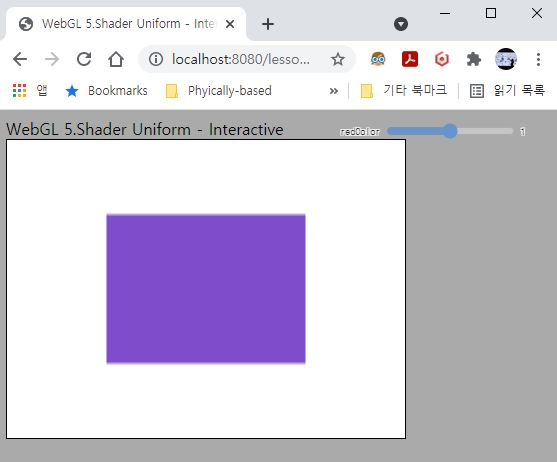

# 5. Shader Uniform - Interactive

자, 이번에는 uniform에 전달할 값을 실시간으로 바꾸어 보겠습니다. 아래 그림에서 보는 것처럼 우측 상단에 슬라이더 UI가 있어서 슬라이더를 움직이면 사각형의 색상이 바뀌도록 할겁니다. 이렇게 사용자의 입력에 따라서 바로 바뀐 결과가 보여지는 프로그램을 인터랙티브한 프로그램이라고합니다.



먼저 좀 큰 그림에서 생각을 해 보겠습니다. 지금까지 코드를 보다보면 한 장의 이미지를 그리기 위해 아래와 같은 작업이 필요한 것으로 생각됩니다. 

1. 정점 데이터(위치 및 인덱스)정보를 정의하고 GPU에 업로드
2. 셰이더를 GPU에 업로드하고 컴파일 & 링크하여 프로그램 생성
3. 정점 Attribute를 읽는 방법을 알려줌
4. (필요한 경우)Uniform에 데이터 업로드
5. 드로우콜(그리기 명령)

맞습니다. 이러한 작업을 통해 이미지가 생성됩니다. 그런데 이번에는 슬라이더를 움직이면 사각형의 색상만 바꾸어 다시 그리려고 합니다. 1~5의 작업이 또다시 이루어져야 할까요?

슬라이더를 움직이면 처음에 파란색이었던 사각형에 약간의 빨간색이 더해질겁니다. 그러면 사각형의 모양은 변할 필요가 없습니다(1번 필요없음). 그리고 색상을 하드코딩하지 않고 셰이더 프로그램 외부에서 uniform으로 데이터를 전달하도록 했으므로 셰이더 코드가 바뀔 일도 없습니다(2번 필요없음). 1번이 바뀌지 않았으니 정점 Attribute를 읽는 방법도 동일합니다(3번 필요없음).

한편, 슬라이더를 움직였을 때 바뀐 색상을 전달해야 하기 때문에 4번 과정은 필요하고, 데이터가 업로드 된 상태로 새로 이미지를 그려야 하기 때문에 5번 과정도 필요합니다. 따라서 4,5번을 별도로 묶어서 슬라이더가 움직일 때마다 수행하도록 해 줄겁니다.

> 위 설명을 GPU의 관점에서 다시 생각해보면 이렇습니다. API를 통해 드로우콜이 들어오면, GPU는 화면을 그리는 데 필요한 모든 정보를 수집합니다. 예를들어 어떤 버퍼에서 데이터를 읽어올지(1번), 어떤 셰이더 프로그램을 사용해서 화면을 그릴지(2번), 해당 버퍼의 데이터를 어떻게 끊어서 셰이더 attibute로 전달할지(3번), 셰이더 프로그램의 uniform에 어떤 값을 사용할지(4번) 등입니다. 

> 물론 `drawElement()`의 인자로 이러한 데이터를 전달하는 것이 아닙니다. 단지 GPU는 현재 활성화(바인딩)된 버퍼/프로그램을 사용해 위와 같은 정보를 수집해 화면을 그리는 것입니다. 드로우콜을 수행하기 이전에, 우리는 상태가 변하지 않는 1~3번을 갱신할 필요 없이 4,5번만 갱신하고 GPU에 드로우콜을 보내면 되는겁니다. 

## How to

이전 코드에서 변화된 내용들을 보자면 아래와 같습니다.

---
1. HTML 페이지에 슬라이더 UI를 생성 

    ```html
        <body>
        <div>WebGL 5.Shader Uniform - Interactive</div>
        <canvas id="c"></canvas>
        <div id="uiContainer"> <!-- UI 컨테이너 추가 -->
            <div id="ui">
                <div id="redColor"></div>
            </div>
        </div>
    </body>
    </html>
    ...
    <!-- lessons-ui에서 제공하는 헬퍼를 사용하면 손쉽게 ui 추가 가능 -->
    <script src="../../resources/webgl-lessons-ui.js"></script> 
    `;
    ```

    `webgl-lessons-ui.js` 라이브러리에 손쉽게 슬라이더를 추가할 수 있는 기능이 구현되어 있습니다. ([WebGL2 Fundamentals의 Greggman에게 다시한번 감사드립니다.](https://webgl2fundamentals.org/webgl/lessons/ko/)) 따라서 해당 라이브러리의 코드를 include(?)하고 HTML에 슬라이더를 생성할 컨테이너를 만들어줍니다.

    ```js
    //---UI 셋업
    var red = 0;
    //슬라이더가 움직일 때마다, slide에 할당할 콜백함수가 호출됨
    webglLessonsUI.setupSlider("#redColor", {slide: updateRedColor, min: 0, max: 1, step: 0.1});
    ```

    `main()`함수 내부에 1~3 과정을 마친 뒤에 오는 코드입니다. red라는 변수를 하나 선언해 주고, 여기에 슬라이더를 통해 변한 값을 저장해 둘겁니다. 
    
    아래줄의 `setupSlider`라는 함수를 통해서 HTML페이지에 슬라이더 UI가 생성됩니다. 중요한 부분은 `slide: updateRedColor`부분입니다. 이 부분은 사용자가 슬라이더를 움직였을때 호출할 콜백함수를 지정하는 부분입니다. 우리는 "updateRedColor"라는 이름의 함수를 호출하도록 지정해 주었습니다.

2. updateRedColor 함수 구현

    ```js
    function updateRedColor(event, ui)
    {
        red = ui.value; //slide의 현재값을 red 변수에 저장
        drawScene(); //화면을 새로 그림
    }
    ```

    바로 아래 부분에 `updateRedColor()`함수를 만들어 두었습니다. 함수 안에 새로운 함수를 정의하는 것이 익숙하지 않으실 수도 있지만 scope에 따른 접근 개념만 정확히 기억하고 계시다면 큰 문제는 없을 거라고 봅니다.

    아까 슬라이더가 움직일 때마다 호출되는 콜백함수가 바로 이 함수입니다. 하는 일은 간단합니다. 현재 슬라이더의 위치에 해당하는 값(`ui.value`을 red변수에 저장합니다. 그리고 `drawScene()` 함수를 호출합니다. `drawScene()`의 구현은 바로 아래에 있습니다.
    
3. drawScene 함수 구현

    ```js
    function drawScene()
    {
        gl.clearColor(0, 0, 0, 0);
        gl.clear(gl.COLOR_BUFFER_BIT | gl.DEPTH_BUFFER_BIT); 

        var location = gl.getUniformLocation(program, "u_color"); 
        gl.uniform4f(location, red, 0.3, 0.8, 1.0); //<-- red변수값을 인자로 전달
        
        //---Draw Call---//
        gl.drawElements(gl.TRIANGLES, 6, gl.UNSIGNED_SHORT, 0); 
    }
    ```

    위 두개의 함수(`gl.clearColor`와 `gl.clear`)의 정확한 의미는 나중에 설명하겠습니다. 지금은 저 두 줄이 없어도 동일하게 잘 실행되지만 표준적이고 일반적인 구현을 위해서 미리 집어넣어 뒀습니다.

    중요한것은 아래 두 덩어리의 코드입니다. 위 두줄은 uniform 값을 설정하는 부분이고 마지막 한 줄은 드로우콜을 하는 부분입니다. 이 페이지의 최상단에서 설명한 4,5번 과정이죠. 4,5번 과정만 `drawScene()`함수 안에 구별해서 슬라이더가 움직일때마다 4,5번만 반복 실행하게 해 둔 것입니다.

    `gl.uniform4f()`의 두번째 인자로 고정된 값 대신 red 변수의 값을 전달하는 것이 보이시나요? 슬라이더가 움직일때마다 red에 다른 값이 저장되고(`updateRedColor`함수에 의해) 그 저장된 값이 셰이더의 `u_color` uniform으로 계속 갱신됩니다. 그러고 나서 드로우콜로 화면이 그려지게 되니, 슬라이더를 움직이면 색상이 바뀐 사각형을 볼 수 있게 되는 것입니다.

---

`http://localhost:8080/lessons/_current/contents.html`(또는 `http://localhost:8080/lessons/5_shader_uniform_interactive/contents.html`)에 접속해서 우측 상단의 슬라이더를 움직여 보세요.  사각형의 색상이 변하는 것을 보실 수 있습니다.

이처럼 uniform을 필요한 시점에 업데이트하고 이미지를 새로 그려서 다른 이미지를 보여주는 것이 인터랙티브 프로그램의 기본적인 동작 방식입니다. 나중에 실제로 해볼거지만 여러분이 게임에서 W,A,S,D를 눌러서 캐릭터를 이동하는 것도, 실제로는 uniform에 정의된 카메라의 위치를 키보드를 누를때마다 업데이트하고 화면을 새로 그림으로써 구현되는 것입니다.

하나 주의하셔야 할 부분은 "drawScene() 안에서는 uniform을 업데이트 하도록 만들면 되는구나."하고 단순히 생각하실 것은 아니라는겁니다. 지금 예제에서는 uniform의 업데이트"만" 필요하기 때문에 그렇게 만든 것이고, 실제로는 필요에 따라 대상 버퍼(정점 데이터)를 바꾸거나 셰이더 프로그램을 바꾸는 것도 얼마든지 할 수 있습니다. 

다시 말씀드리지만, <span style="color:red">**드로우콜을 하면 GPU는 현재 바인딩된 상태의 데이터와 셰이더 프로그램으로 화면을 그립니다.**</span> 이 문장만이 확실한 사실입니다. 나머지 예제에서 보여드린 것은 모두 이에 대한 단편적인 예시일 뿐이고 앞으로도 마찬가지입니다. 

다음 예제에서는 사각형 하나가 아닌 사각형 하나와 삼각형 하나를 동시에 화면에 그릴건데, 그 코드를 보시면 좀 더 명확하게 이해가 되실 것 같습니다.

## Quiz

1. `gl.getUniformLocation()`도 반드시 `drawScene()`안에서 호출되어야 할까요? 직접 확인해 보세요.

2. 제일 처음 페이지를 로드하면(또는 새로고침하면) 슬라이더를 움직이기 전까지 화면에 아무것도 나오지 않습니다. 이를 해결해 보세요.

3. 지난 퀴즈에서처럼, offset을 사용해 사각형의 위치를 슬라이더를 사용해 변경할 수 있도록 코드를 수정해 보세요.

## Useful Links

- [WebGL2 상태 다이어그램](https://webgl2fundamentals.org/webgl/lessons/resources/webgl-state-diagram.html): 실제 GPU 내부의 상태 변수들이 API 호출에 따라 어떻게 변하는지 눈으로 확인 가능합니다. 꼭 한번 실행해 보세요.
