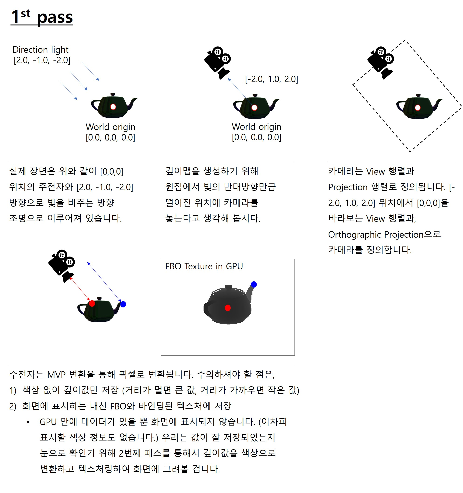
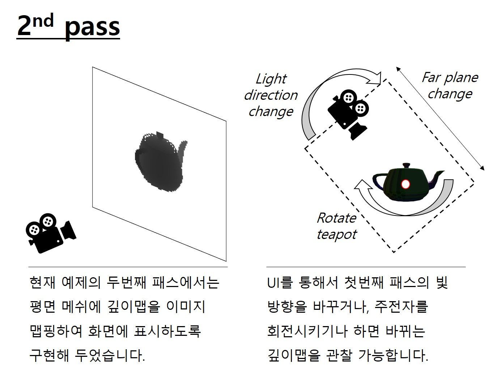
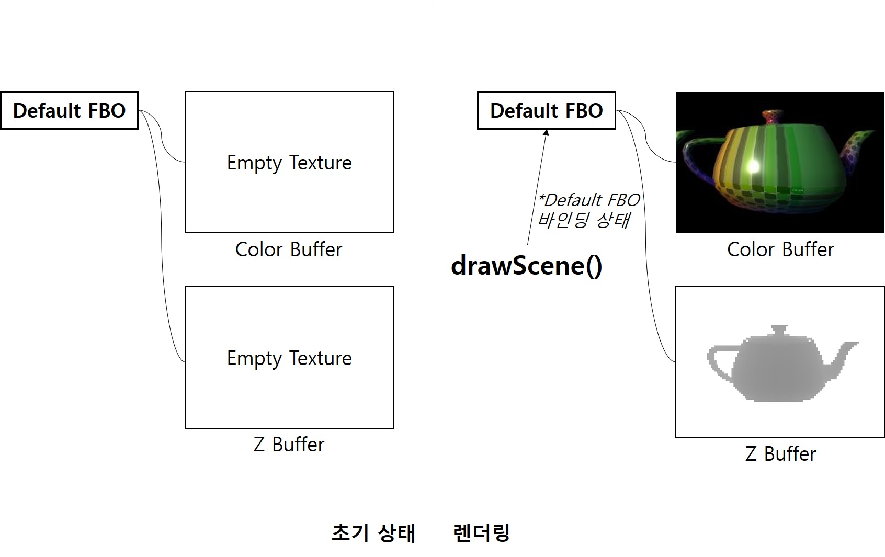

# 19. Depth Map

이번 강의에서는 Shadow mapping을 통한 그림자 효과 구현에 필요한 Depth map(깊이맵)의 생성 방법에 대해 알아보도록 하겠습니다. 깊이맵은 그림자를 그릴때 뿐만 아니라 다양한 그래픽 효과의 구현을 위해 유용하게 활용될 수 있는 데이터 입니다. 예를들어 얼마전 [Unity3D에서 Force field](https://www.youtube.com/watch?v=NiOGWZXBg4Y)(오버워치에서 윈스턴이 쓰는 방어막 같은... 뭔지 아시나요?)의 구현에 대한 영상을 본 적이 있는데 이 과정에서도 장면의 깊이 정보를 사용하고 있습니다.

이론 강의에서 설명드린대로 shadow mapping을 통한 그림자 구현은 two pass 알고리즘인데, 첫 번째 패스에서 깊이맵을 생성합니다. 여기서 pass란 화면을 그리는 횟수를 의미하는데요, 지금까지 우리가 구현한 코드에서는 모두 한 번의 패스로 화면을 그렸습니다. 즉 한 프레임의 화면을 그리기 위해 정점 셰이더와 프래그먼트 셰이더를 거쳐 색상을 계산하면 끝이었습니다. 

하지만 그림자 효과 구현은 좀 다릅니다. 첫번째 패스에서는 두번째 패스에서 사용할 데이터를 생성하고, 두번째 패스에서는 화면에 표시할 색상을 계산하기 위해 첫번째 패스에서 생성한 데이터를 참조해야만 합니다. 이렇게 두 번의 그리기가 필요하기 때문에 two pass 알고리즘이라고 합니다. 

> 두 번의 그리기가 필요하기 때문에 그림자를 그리는 것은 대체로 무거운 연산에 속합니다. (그래픽 옵션에서 그림자를 끄면 FPS가 올라가는 이유입니다.) 게임 엔진에서는 정적인 조명과 물체는 미리 그림자(+조명 효과)를 계산해서 텍스처에 써놓기도 합니다.(Lightmap baking)

---

### FBO(Frame Buffer Object)

이 강의에서 중요하게 알아두셔야 할 개념은 프레임버퍼(Frame Buffer Object, FBO) 입니다. [프레임 버퍼](https://webgl2fundamentals.org/webgl/lessons/ko/webgl-framebuffers.html)란 색상 버퍼+깊이 버퍼+스텐실 버퍼의 집합을 이야기 합니다. 색상 버퍼는 색상 정보를 저장하는 이미지, 깊이 버퍼는 깊이값을 저장하는 이미지(Z-buffer)로 생각하시면 됩니다. (스텐실 버퍼는 강의 내용에서 벗어나니 생략하겠습니다.)

> 프레임버퍼는 개념적인 용어이고, API호출을 통해 만든 프레임버퍼 객체가 FBO입니다. 굳이 정교하게 구분할 필요는 없으니 이 글에서 한글로는 그냥 프레임버퍼로, 영문으로는 FBO로 적겠습니다.

사실 우리가 화면에 그리던 장면들은 모두 이 프레임 버퍼에 먼저 그려진 후에 화면에 나타나고 있었습니다. 프래그먼트 셰이더에 의해 계산된 색상들이 Z-buffering 과정(Output Merging 강의 참고)을 거쳐서 색상 버퍼와 깊이 버퍼에 쓰여지고, 이중 색상 버퍼가 캔버스에 표시된 것입니다. 우리가 직접 프레임 버퍼를 만들지 않아도 기본(Default) 프레임버퍼가 있기 때문에 이것이 가능했습니다. (참고로 Direct3D 11의 경우에는 화면을 그리기위한 첫 프레임버퍼를 만드는 것까지 프로그래머가 반드시 해주어야 합니다.)

이번 강의에서는 첫 번째 패스에서 깊이맵을 저장하기 위해 프레임버퍼를 하나 더 만들어줄겁니다. 만들어둔 프레임버퍼의 깊이 버퍼에 깊이값을 저장해 두고 이를 두번째 패스에서 참조하여 사용할 것입니다.

---

### 1st pass and 2nd pass

아래 그림에는 이번 강의 코드에서 첫번째 패스와 두번째 패스가 어떤 작업을 하는지 설명해 두었습니다. 매 프레임마다(매 `drawScene()` 호출마다) 첫번째 패스와 두번째 패스가 한번씩 호출된다는 점을 잘 기억해 두십시오. 그리고, 현재의 두번째 패스는 깊이맵이 잘 그려졌는지 확인하는 목적으로 만들어 둔 것이고, 다음 강의에서는 두번째 패스가 그림자를 화면에 그리는 과정으로 바뀔 것이라는 것도요.





---

## How to

이전 코드에서 변화된 내용들을 보자면 아래와 같습니다. 보셔야 하는 파일들을 번호 목록 앞에 표기해 두었습니다.

---
1. [`_classes/ShadowLight.js`] DepthMap 클래스 구현

    `ShadowLight.js`안에 Light, DirectionalLight, DepthMap 클래스가 모두 구현되어 있습니다. 새로 생성된 DepthMap 클래스부터 설명을 드리겠습니다. 코드가 길기 때문에 부분부분 설명하고, 설명이 필요없을만큼 명확한 부분은 설명을 생략하도록 하겠습니다.

    ```js
    constructor(gl,width, height)
    {
        ...
    
        //프레임 버퍼에 쓰여진 데이터는 텍스처로 저장할 겁니다.
        this.mapID = gl.createTexture();
        gl.bindTexture(gl.TEXTURE_2D, this.mapID);

        //텍스처를 생성합니다. 데이터는 null로 초기화합니다.
        gl.texImage2D(gl.TEXTURE_2D, 0, gl.DEPTH_COMPONENT32F, this.width, this.height, 0, gl.DEPTH_COMPONENT, gl.FLOAT, null);
        ...
        gl.texParameteri(gl.TEXTURE_2D, gl.TEXTURE_MIN_FILTER, gl.NEAREST);
        gl.texParameteri(gl.TEXTURE_2D, gl.TEXTURE_MAG_FILTER, gl.NEAREST);
        //!!(주의)!!mag & min filter model를 linear로 하면 제대로 동작하지 않음!
        ...        

    ```

    생성자 초반부에서는 우선 텍스처를 만들고 있습니다. 프레임버퍼는 색상과 깊이 버퍼를 가질 수 있다고 했었고, 각각의 색상 버퍼와 깊이 버퍼는 이미지라고 했었죠? 따라서 이미지 데이터를 저장할 텍스처를 함께 만들어 주어야 합니다.

    텍스처를 만드는 코드는 [Texture 강의](../14_texture/README.md)에서 설명 드렸습니다. 그런데 여기서는 `texImage2D()`의 인자들이 조금 다릅니다. internal format으로 `gl.DEPTH_COMPONENT32F`를, 크기는 인자로 받은 `width`와 `height`를, format으로는 `gl.DEPTH_COMPONENT`를, type으로는 `gl.FLOAT`을 사용하고 있습니다.

    깊이값은 32비트 float으로 저장되기 때문에 위와 같이 `width`와 `height` 해상도를 갖는 32비트 float 텍스처를 만들도록 설정한 것입니다. 마지막 인자(데이터)에 null을 설정해서 빈 텍스처를 생성해 둡니다. 이 텍스처는 프레임버퍼에 부착(attach)되어 첫번째 패스를 통해 값이 쓰여질 것이기 때문에 미리 어떤 데이터를 집어넣어 둘 필요가 없습니다.

    주의하실 점은 텍스처 관련 파라메터를 설정할 때 minification과 magnifination filter를 `gl.NEAREST`(기본값)로 설정해 두어야 한다는 것입니다. `gl.LINEAR`로 설정하면 WebGL에서는 제대로 동작하지 않습니다.

    ```js
        this.fboID = gl.createFramebuffer();
        gl.bindFramebuffer(gl.FRAMEBUFFER, this.fboID);
        gl.framebufferTexture2D(gl.FRAMEBUFFER, gl.DEPTH_ATTACHMENT, gl.TEXTURE_2D, this.mapID, 0);
    ```

    이어지는 코드를 보면 프레임버퍼를 만들고 바인딩하였습니다. 이제 기본 프레임버퍼 이외에 또하나의 프레임버퍼가 생성되었습니다. 그리고 나서 `gl.framebufferTexture2D()` API로 방금 만들어둔 텍스처(=this.mapID)를 이 프레임버퍼에 부착해 두고 있습니다. 프레임버퍼는 색상 버퍼와 깊이 버퍼(Z-buffer)로 구성되고 있는데, 이중 텍스처를 Z-buffer에 부착하겠다는 것을 `gl.DEPTH_ATTACHMENT`를 사용해 명시하였습니다.

    프레임버퍼는 우리가 화면을 그리는 "대상"입니다. <span style="color:red">따라서 현재 어떤 프레임버퍼가 바인딩되어있느냐에 따라 어디에 렌더링 결과가 저장될지가 결정됩니다. </span> 기존에는 아래 그림과 같았습니다. 우리가 아무것도 하지 않아도 기본 프레임버퍼(Default FBO)가 있었고, 바인딩된 상태이기 때문에 드로우콜을 호출하면 그 프레임버퍼에 장면이 그려졌습니다.

    

    이제 우리는 새로운 프레임버퍼를 만들고 깊이값을 저장할 텍스처를 부착해 두었으니 초기화가 끝나면 아래 그림의 왼쪽과 같은 상태가 됩니다. 첫번째 패스에서 기본 프레임버퍼 대신에 우리가 만든 프레임버퍼(Created FBO)를 바인딩하고 드로우콜을 호출하면 그 프레임버퍼에 장면이 그려집니다. 대신에, 색상 버퍼는 부착해두지 않았기 때문에 색상 버퍼에는 그릴 것이 없습니다.

    

    ```js
    Bind(gl)
    {
        gl.bindFramebuffer(gl.FRAMEBUFFER, this.fboID);
    }

    Unbind(gl)
    {
        gl.bindFramebuffer(gl.FRAMEBUFFER, null);
    }

    Read(gl,slot)
    {
        //Texture의 bind와 동일합니다.
        gl.activeTexture(gl.TEXTURE0 + slot);
        gl.bindTexture(gl.TEXTURE_2D, this.mapID);    
    }
    ```

    `Bind()`, `Unbind()` 메소드는 프레임버퍼의 바인딩 및 언바인딩을 위한 메소드입니다. 첫번째 패스를 거쳐서 값이 저장된 텍스처(mapID)를 읽어와 사용하기 위해서 `Read`라는 별도의 메소드를 구현해 두었습니다. Texture 클래스의 바인딩과 동일한 API들을 호출합니다.

2. [`_classes/ShadowLight.js`] Light 클래스 구현

    ```js
    class Light {
        ...
    
        constructor(gl, mapWidth, mapHeight, lightColor, aIntensity, dIntensity)
        {
            this.depthMapWidth = mapWidth;
            this.depthMapHeight = mapHeight;
            ...

            this.depthMap = new DepthMap(gl, this.depthMapWidth, this.depthMapHeight);
        }
    }
    `;
    ```

    `BasicLight.js`를 두고 `ShadowLight.js`를 새로 만들어 사용하는 이유는 위 코드를 보면 명확합니다. Light 클래스는 이제 그림자를 그리기 위한 depthMap 객체를 멤버로 가집니다. 그래서 Light 클래스(그리고 그 유도 클래스인 DirectionalLight 클래스) 객체를 만들때 depthMap 텍스처 해상도를 결정하기 위한 `mapWidth`와 `mapHeight` 인자를 같이 받도록 했습니다.

3. [`_classes/ShadowLight.js`] DirectionalLight 클래스 구현

    ```js
    export class DirectionalLight extends Light {
        ...

        UseLightForShadow(gl,shader) 
        {
            shader.SetUniformMat4f(gl,"u_directionalLightViewProjection", this.CalculateLightTransform());
        }

        CalculateLightTransform()
        {
            this.lightProjection = mat4.create();
            mat4.ortho(this.lightProjection, -10.0, 10.0, -10.0, 10.0, 0.1, this.farPlane);

            let negDirection = vec3.create();
            vec3.scale(negDirection, this.direction, -1.0);
            let lightView = mat4.create();
            mat4.lookAt(lightView, negDirection, [0.0,0.0,0.0], [0.0,1.0,0.0]);

            let viewProjectionMat = mat4.create();
            mat4.multiply(viewProjectionMat, this.lightProjection, lightView);

            return viewProjectionMat;
        }

        ...
    }
    ```

    DirectionalLight의 핵심적인 부분은 위 두 메소드입니다. 물론 `UseLight()` 메소드도 굉장히 중요하지만 이는 다음 강의에서 사용할겁니다. 이론 강의와 이 문서의 첫번째 그림에서 설명드린 것처럼 그림자 효과를 구현하기 위해서는 광원의 위치에서 바라본 장면의 깊이값이 필요합니다. 마치 광원 위치에 카메라를 위치시킨 것처럼요. 카메라라는  것은 단지 뷰 행렬과 투영 행렬로 정의될 뿐이라는 것을 이제 알고계실겁니다.

    `CalculateLightTansform()` 메소드는 DirectioanlLight의 뷰 행렬과 투영 행렬을 계산하고 그 두 행렬을 곱해 반환해줍니다. 뷰 행렬은 glMatrix의 `lookAt()` 메소드를 사용해 만들고 있는데요, EYE는 negDirection, AT은 [0,0,0] UP은 [0,1,0]을 사용하고 있습니다. Directional light는 광원의 위치가 특별히 정해져 있지 않기 때문에 원점에서 광원의 반대 방향만큼 떨어진 위치를 임의로 EYE 위치로 결정해 사용하고 있습니다. 그리고 원점을 바라보도록(AT) 설정해 두었습니다.

    투영 행렬은 직교 투영(Orhographic projection) 행렬을 만들어주는 `ortho()` 메소드를 사용해 만들고 있습니다. 크기는 가로세로 20이고, near plane은 0.1, far plane은 필드에 저장된 크기를 사용하고 있습니다. UI를 통해서 far plane의 크기를 바꿔가며 깊이맵이 어떻게 바뀌는지 관찰해 보기 위함입니다. 마지막에는 투영 행렬과 뷰 행렬을 곱해서 반환해 줍니다.

    `UseLightForShadow()` 메소드는 셰이더의 `u_directionalLightViewProjection` uniform에 방금 만든 투영 행렬과 뷰 행렬의 곱을 전달해 주는 메소드입니다. 이제 이 행렬이 셰이더에서 어떻게 사용되는지 한번 봅시다.

4. [`main.js`] 깊이맵 생성을 위한 정점 셰이더

    ```glsl
    //--Depth map을 생성하기 위한 shader
    var dirDepthMapVertexShader = `#version 300 es
    layout(location=0) in vec3 a_position; 

    uniform mat4 u_model; //모델의 world공간 위치와 자세
    uniform mat4 u_directionalLightViewProjection; //카메라의 VP 행렬

    void main() {
        gl_Position = u_directionalLightViewProjection * u_model * vec4(a_position,1.0);
    }
    `;
    ```

    깊이맵 생성을 위한 정점 셰이더는 일단 `main.js`에 직접 만들어 두었습니다. uniform으로는 `u_model`과 `u_directionalLightViewProjection`을 받고 있습니다. 방금 DirectionalLight의 `UseLightForShadow()` 메소드를 사용해 입력받을 uniform이네요.

    `main()`에 보면, MVP행렬을 `a_position`에 곱하고 있습니다. 우리가 지금까지 계속 해왔던 클립 공간 변환입니다. 단지 다른점은, 우리가 `mainCamera` 객체에 정의해둔 뷰 및 투영 행렬을 곱해서 클립 공간 변환을 하는것이 아니고, DirectionalLight 객체로 정의한 뷰 및 투영 행렬을 곱해서 클립 공간 변환을 한다는 것입니다. 그러니, 최종 변환 결과는 광원 위치에 카메라가 있는 상태에서의 클립공간 좌표가 될 것입니다. 강의 자료에서는 이를 "light space"라고 지칭하였습니다. 저는 이후 필요한 경우 "조명 공간"이라고 한글로 표기하도록 하겠습니다.

5. [`main.js`] 깊이맵 생성을 위한 프래그먼트 셰이더

    ```glsl
    var dirDepthMapFragmentShader = `#version 300 es
    //프래그먼트 셰이더는 아무것도 하지 않아도 됩니다.
    precision highp float;

    void main()
    {

    }
    `;
    ```

    재미있는 부분이죠? 깊이맵 생성을 위한 프래그먼트 셰이더 소스코드인데요, 보시다시피 아무 내용도 없습니다. 그냥 셰이더의 형체만 가지고 있을 뿐입니다. 
    
    첫번째 패스에서는 우리가 생성한 프레임버퍼에 그릴건데, 색상 버퍼를 부착해 두지 않았습니다. 색상값을 사용할 것이 아니니까요. 그러니 프래그먼트 셰이더에서 색상을 계산할 필요가 없습니다.

    깊이값은 계산하지 않아도 되나요? 네. 계산하지 않아도 됩니다. 왜냐하면 Output merger에서 Z-buffering을 수행하면서 내부적으로 알아서 깊이값을 계산해 저장해 두기 때문입니다. 우리는 이미 생성한 버퍼의 Z-buffer에 텍스처를 부착해 두었기 때문에(`gl.DEPTH_ATTACHMENT`) 프래그먼트 셰이더에서 아무 계산을 하지 않아도 우리가 부착해둔 텍스처에 Z-buffer값이 쓰여져 있게 될겁니다.

6. [`main.js`] 1st pass 렌더링

    ```js
    function drawScene()
    {
        // --- 1st pass--- //
        {
            depthMapShader.Bind(gl);
            mainLight.UseLightForShadow(gl, depthMapShader);

            // 주전자 그리기
            let model = mat4.create();
            mat4.rotateY(model, model, teapotYRoatation * Math.PI / 180.0);
            mat4.scale(model, model, [0.1, 0.1, 0.1]);
            mat4.translate(model, model, [0.0, 1.0, 0.0]);
            depthMapShader.SetUniformMat4f(gl, "u_model", model);

            mainLight.depthMap.Bind(gl); // depth map 프레임버퍼 바인딩
            gl.viewport(0, 0, mainLight.depthMapWidth, mainLight.depthMapHeight); // depth map에 그리기 때문에 뷰포트도 그에 맞게 조정
            
            renderer.Clear(gl);

            teapot.RenderModel(gl, depthMapShader);
            
            mainLight.depthMap.Unbind(gl); //(주의!) depth map을 위한 FBO를 unbind하지 않으면 2nd pass에서 화면에 표시되는 프레임 버퍼가 그려지지 않음!
            depthMapShader.Unbind(gl);
        }
    }
    ```

    먼저 1st pass가 그려지는 과정을 봅시다. 방금 보여드린 깊이맵 생성을 위한 셰이더를 바인딩 해줍니다. `u_directionalLightViewProjection` uniform의 입력은 mainLight가 가지고있는 `UseLightForShadow()` 메소드를 호출하면 됩니다. (3번 설명 참고)

    모델 행렬은 장면에 있는 주전자의 월드 공간 변환 행렬입니다. [0,1,0] 위치에 0.1 스케일로 배치해 놓았고, UI를 통해 Y축 회전을 수행할 수 있도록 해 두었습니다. 계산된 모델 행렬은 깊이맵 정점 셰이더로 전달됩니다.

    <span style="color:red">이제 우리가 생성한 프레임버퍼(Created FBO)를 바인딩합니다.</span> `mainLight.depthMap.Bind(gl)` 명령문을 사용하면 됩니다. 이후 우리가 드로우콜을 호출하면 이제 이 프레임버퍼에 데이터가 쓰여지게 될겁니다. <span style="color:red">주의하실 것은 그리기 전에 뷰포트를 조정해 주어야 한다는 것입니다.</span> 깊이맵 텍스처의 크기와 뷰포트의 크기가 맞지 않으면 화면 공간 변환이 제대로 되지 않을겁니다. 

    그러고 나서 프레임버퍼를 지워주고, 주전자를 렌더링합니다. 만일 장면에 다른 물체들이 더 있다면 여기에서 렌더링을 해주면 그 물체들도 깊이값이 깊이맵에 저장될겁니다. 

    <span style="color:red">그리기가 완료되었으면 FBO를 언바인딩합니다.</span> 주석에 써있는것처럼 여기서 언바인딩을 해주지 않으면 두번째 패스에서 기본 프레임버퍼에 그리는 것이 아니고 계속 우리가 만든 프레임버퍼에 그리기를 수행하기 때문에 제대로 된 결과가 나오지 않습니다.

---

이제 아래는 두번째 패스와 관련된 코드들입니다.

---

7. [`main.js`] 깊이맵 가시화를 위한 프래그먼트 셰이더

    ```glsl
    var dirDepthMapVisualizationFragmentShader = `#version 300 es

    precision highp float;

    layout(location=0) out vec4 outColor;

    in vec2 v_texcoord;
    in vec3 v_normal;

    uniform sampler2D u_depthTexture;

    void main() {
        float depthValue = texture(u_depthTexture, v_texcoord).r; // <-- (1)
        outColor = vec4(depthValue,depthValue,depthValue,1.0);
    }
    `;
    ```

    두번째 패스에서는 첫번째 패스를 통해 저장된 깊이맵 데이터를 사각형 평면에 텍스처 맵핑하여 화면에 그려볼겁니다. 텍스처 맵핑을 위해 셰이더를 위와 같이 구현하였습니다. (정점 셰이더는 이전 강의에서 사용하던 정점 셰이더와 동일합니다.)

    outColor에 텍스처에 저장된 값을 직접 표시하는 대신, 우선 (1)의 코드를 통해 깊이맵에 저장되어 있는 r값을 `depthValue`에 저장해 두었습니다. `texture()` 함수는 텍스처에 저장된 색상값을 텍스처 좌표를 기반으로 샘플링하여 반환해주는 함수입니다. 그런데 깊이값은 한 채널의 32bit float 값이므로 RGBA 네 개의 채널에 저장되는 것이 아니고, 그중 첫번째 채널인 R채널에 저장됩니다. 따라서 float 깊이값을 읽어오려면 위와 같이 작성해야 합니다.

    출력 색상은 RGB에 모두 `depthValue`값을 할당하도록 했습니다. 만일 depthValue가 1.0이라면 흰색으로, 0.0이라면 검은색으로 표시될겁니다. 그리고 그 사이의 깊이값은 클수록 밝은 회색으로, 작을수록 더 어두운 회색으로 표시될겁니다.

8. [`main.js`] 2nd pass 렌더링
    
    ```js
    function drawScene()
    {
        // --- 1st pass--- //
        ...

        // --- 2nd pass--- //
        {
            //화면 크기 재조정
            webglUtils.resizeCanvasToDisplaySize(gl.canvas);
            gl.viewport(0, 0, gl.canvas.width, gl.canvas.height);

            textureShader.Bind(gl); 
            mainLight.depthMap.Read(gl,0); // <-- (1)
            textureShader.SetUniform1i(gl, "u_depthTexture", 0);

            let modelMat = mat4.create();
            mat4.scale(modelMat, modelMat, [0.1, 0.1, 0.1]);
            mat4.rotateX(modelMat, modelMat, Math.PI/2); 
            textureShader.SetUniformMat4f(gl, "u_model", modelMat);
            var view = mainCamera.CalculateViewMatrix();
            textureShader.SetUniformMat4f(gl, "u_view", view);
            textureShader.SetUniformMat4f(gl, "u_projection", proj);

            renderer.Clear(gl);

            ground.RenderModel(gl, textureShader); //plane을 화면에 그립니다.

            textureShader.Unbind(gl);
        }
    ```

    두번째 패스에서는 7번에서 작성한 셰이더(`textureShader`)를 사용해 화면을 그릴겁니다. 먼저 그리기를 수행하기 전에, 뷰포트의 크기를 웹페이지의 캔버스 크기에 다시 맞춥니다. 이전에서는 깊이맵의 크기에 맞추었지만, 이제는 사용자에게 보여지는 웹페이지에 그릴것이기 때문에 캔버스의 크기에 맞추어야 합니다.

    셰이더를 바인딩한뒤에 먼저 깊이맵을 0번 텍스처 유닛에 바인딩한 뒤에 ((1) 부분) 0번 텍스처 유닛을 셰이더의 `u_depthTexture` 샘플러 uniform이 사용하도록 합니다. 우리가 텍스처에 대해 배웠을때와 동일한 API들을 호출하고 있다는 것을 체크하시기 바랍니다. 깊이맵 또한 텍스처에 저장된 데이터일 뿐입니다.

    다음으로는 깊이맵 텍스처를 맵핑할 평면(ground)의 모델 행렬을 정의합니다. ground에 대한 설명은 생략했는데 `SubdividedPlane_100.obj` 파일에 저장되어 있는 단순한 사각형 모델입니다. 이 사각형을 0.1 스케일로 줄이고, x축 기준으로 회전하여 카메라를 바라보도록 뷰 행렬을 만들었습니다.

    이후 프레임 버퍼를 지우고, 평면을 렌더링합니다. textureShader에 의해 첫번째 패스에서 저장된 깊이맵이 프래그먼트 셰이더를 통해 평면에 맵핑되어 우리에게 보여집니다.

---

`http://localhost:8080/lessons/_current/contents.html`(또는 `http://localhost:8080/lessons/19_depth_map/contents.html`)에 접속해 보시면 아래와 같은 화면을 보실 수 있습니다. UI에 관련한 코드까지 모두 설명드리지는 않았는데 이제는 코드를 찬찬히 보시면 이해하실 수 있을 거라고 믿습니다. 

- Light X/Y/Z direction 슬라이더를 움직이면 directional light의 방향이 변합니다. 방향이 변하면 첫번째 패스에서 뷰 행렬의 EYE 위치가 변하게 되므로 깊이맵도 변하게 됩니다. 지금 눈에 보이는 장면이 조명의 위치에서 [0,0,0]을 바라보는 장면이라는 것을 머리속으로 상상하면서 값을 바꿔 보세요.

- Teapot Y rotation 슬라이더를 움직이면 주전자가 제자리에서 회전합니다. 첫번째 패스에서 주전자의 모델 행렬이 바뀌는 것입니다.

- Light far plane 슬라이더의 값을 올리면 주전자가 검게 변하고, 값을 내리면 주전자가 밝아지다가 보이지 않게 됩니다. 모든 변환을 거치고 나면 Z-buffer에 저장되는 깊이값은 near plane은 0, far plane은 1로 정규화된 깊이값입니다. far plane이 멀다면, 주전자는 어느 프래그먼트든 아주 작은 깊이값으로 정규화 되기때문에 거의 검게 보이는 것입니다.


---

분량이 꽤 길어졌는데요, 프레임버퍼에 대한 개념을 우선 정확히 이해하시는 것이 중요할 것 같아서 자세히 설명하느라 그렇게 된 것 같습니다. 코드에도 변화가 많아서 일일히 다 설명드리지는 못했는데, 여러분이 시간을 들여서 좀 더 살펴보시고, 궁금한 점이 있으시면 질문해 주시면 좋을 것 같습니다.

다음 강의에서는 이렇게 얻어진 깊이맵을 사용하여 장면에 그림자 효과를 생성하는 Shadow mapping 기법을 구현해 보도록 하겠습니다.

## Quiz

1. 슬라이더 UI를 하나 더 추가해서 두번째 패스의 카메라의 z방향 위치를 인터랙티브하게 변경할 수 있도록 구현해 보세요.

2. 첫번째 패스에 다른 주전자 또는 육면체를 추가적으로 배치해서 깊이맵을 그려 보세요.

3. `main.js`의 `gl.enable(gl.DEPTH_TEST)`를 주석처리한 상태에서 페이지에 접속해 보세요. 왜 깊이맵이 나타나지 않는걸까요?

4. `_classes/Renderer.js`의 `Clear()` 메소드에서 `gl.clear()` API를 호출할때 인자로 넘겨준 `gl.DEPTH_BUFFER_BIT`은 어떤 의미일까요? 또, 해당 옵션을 주지 않으면 어떻게 될까요?

## Advanced

1. Z-buffering을 수행하면 깊이값을 자동으로 계산해 주지만 사실 깊이값은 우리가 직접 프래그먼트 셰이더에서 색상으로 변환해 출력하는 것도 가능합니다. [텍스처에 렌더링하기(Render to texture)](https://webgl2fundamentals.org/webgl/lessons/ko/webgl-render-to-texture.html)를 참고하여 첫번째 패스에서는 색상 버퍼에 깊이값을 계산해서 쓰고, 두 번째 패스에서는 색상 버퍼에 부착된 텍스처를 맵핑하도록 코드를 바꿔 보세요.

2. 투영 행렬로 직교 투영을 사용한 이유는 광원이 directional light기 때문입니다. Point light의 경우 원근 투영을 사용하는 것이 맞겠죠? Light의 유도 클래스인 PointLight 클래스를 구현하고, 장면에 point light를 배치하여 깊이맵을 그려 보세요. ([그림자 맵핑](https://webgl2fundamentals.org/webgl/lessons/ko/webgl-shadows.html) 참고)

## Useful Links

- [그림자 맵핑](https://webgl2fundamentals.org/webgl/lessons/ko/webgl-shadows.html)
- [텍스처에 렌더링하기](https://webgl2fundamentals.org/webgl/lessons/ko/webgl-render-to-texture.html)
- [프레임 버퍼](https://webgl2fundamentals.org/webgl/lessons/ko/webgl-framebuffers.html)
- [Unity3D 셰이더 그래프를 활용한 Force field 구현](https://www.youtube.com/watch?v=NiOGWZXBg4Y)


